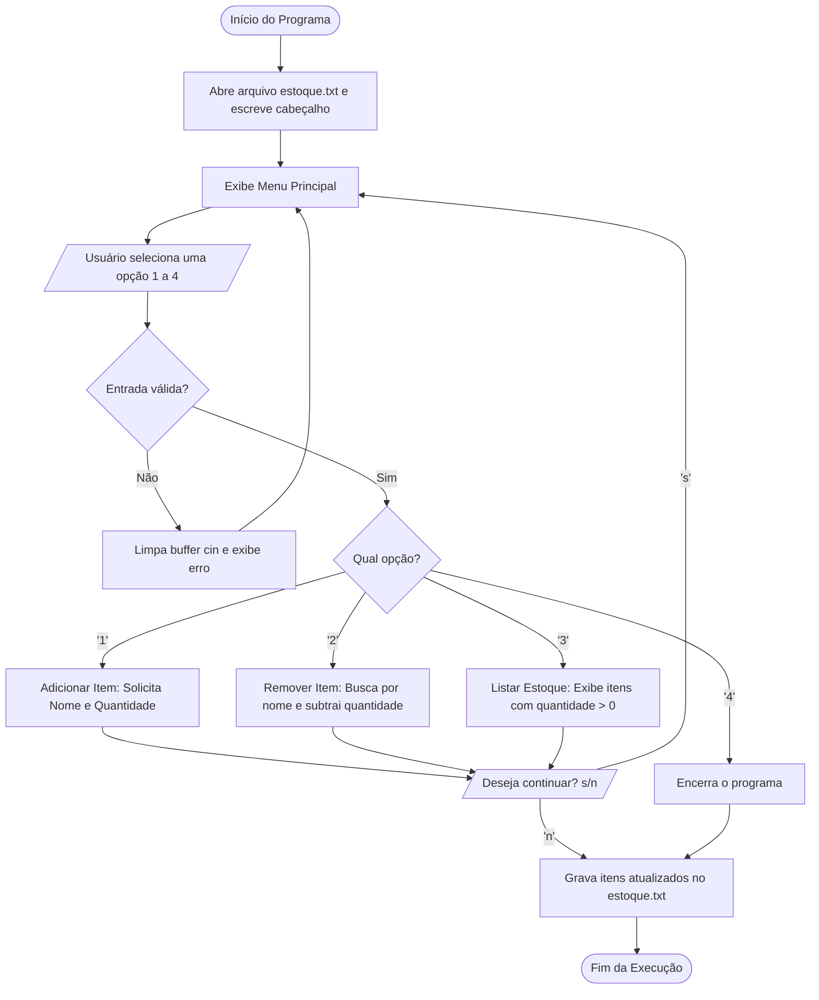

# 📖 Documentação Técnica - Controle de Estoque

Esta documentação fornece uma visão detalhada da arquitetura, fluxo de execução, funções e estruturas de dados do sistema **Controle de Estoque**.

---

## 🏗️ 1. Arquitetura e Estrutura de Dados

O programa foi desenvolvido em **C++** como uma aplicação de console interativa baseada em menus.

### 1.1 Estruturas de Armazenamento em Memória
O sistema armazena os dados em arrays estáticos globais:

- `lsnit` (`std::array<std::string, 100>`): Armazena os nomes dos produtos cadastrados.
- `lsqit` (`std::array<int, 100>`): Armazena as respectivas quantidades disponíveis para cada produto no mesmo índice.
- `count` (`int`): Contador de iterações/itens manipulados.

> **Relação por Índice:** O item armazenado em `lsnit[i]` possui sua quantidade correspondente em `lsqit[i]`.

---

## 🔄 2. Fluxograma de Execução



---

## ⚙️ 3. Detalhamento das Funções

### `int main()`
- **Responsabilidade:** Ponto de entrada da aplicação.
- **Fluxo:**
  1. Cria/abre o arquivo `estoque.txt` gravando o cabeçalho formatado com `std::setw`.
  2. Executa o loop principal exibindo o menu interativo via `printMenu()`.
  3. Realiza o tratamento de entradas inválidas via `cin.fail()`.
  4. Redireciona o fluxo para a opção escolhida (`1`, `2`, `3` ou `4`).
  5. Pergunta ao usuário se deseja continuar (`s/n`).
  6. Ao finalizar, grava os dados de `lsnit` e `lsqit` no arquivo `estoque.txt` e fecha o stream com `arquivo.close()`.

### `void printMenu()`
- **Responsabilidade:** Exibe o cabeçalho visual e as opções disponíveis no terminal:
  - `1. Adicionar item`
  - `2. Remover item`
  - `3. Listar estoque`
  - `4. Sair`

### `void removeItem()`
- **Responsabilidade:** Permite dar baixa ou decrementar quantidades de produtos existentes.
- **Fluxo:**
  1. Solicita o nome do produto a ser removido.
  2. Itera pelo array `lsnit` procurando correspondência exata.
  3. Se encontrado, solicita a quantidade a subtrair:
     - **Quantidade restante $\ge 1$:** Atualiza a quantidade em `lsqit[i]`.
     - **Quantidade restante $= 0$:** Zera o estoque do item.
     - **Quantidade informada maior que a disponível:** Alerta que o estoque é insuficiente.
  4. Se o item não for encontrado, informa que o produto não existe.
  5. Pergunta se o usuário deseja remover mais algum item (`s/n`).

### `void printEstoque()`
- **Responsabilidade:** Imprime no console todos os produtos cadastrados com quantidade em estoque.
- **Fluxo:**
  1. Itera por `lsnit` verificando posições preenchidas (`lsnit[i] != ""`).
  2. Exibe o nome e a respectiva quantidade formatada.
  3. Se nenhum item estiver cadastrado, exibe a mensagem `"O estoque está vazio."`.

---

## 💾 4. Persistência de Dados (`estoque.txt`)

O programa grava o estado final do estoque no arquivo texto `estoque.txt`.

### Formato gerado:
```text
=============
   estoque
=============

[Nome_do_Item_1]
[Quantidade_1]
[Nome_do_Item_2]
[Quantidade_2]
```

---

## 🛡️ 5. Tratamento de Erros e Validações

- **Validação de Tipo no `std::cin`:**
  ```cpp
  if (cin.fail()) {
      cin.clear();            // Limpa flags de erro
      cin.ignore(1000, '\n'); // Descarta caracteres restantes no buffer
      cout << "Entrada inválida! Digite um número." << endl;
      continue;
  }
  ```
- **Verificação de Limite de Estoque:** Impede remoção de quantidades superiores ao saldo disponível.
- **Flag de Existência:** Garante feedback claro caso o item buscado não exista.

---

## 🚀 6. Sugestões de Melhorias e Refatoração

Para evolução do projeto em versões futuras:
1. **Modelagem Orientada a Objetos (POO):**
   - Criar uma classe ou struct `Item` (com atributos `nome`, `quantidade`, `preco`).
   - Criar uma classe gerenciadora `Estoque`.
2. **Coleções Dinâmicas:**
   - Substituir arrays de tamanho fixo (`array<T, 100>`) por `std::vector<Item>` ou `std::map<string, int>`, permitindo capacidade ilimitada e busca $O(1)$ ou $O(\log n)$.
3. **Leitura na Inicialização:**
   - Carregar os dados salvos em `estoque.txt` no início da execução, permitindo persistência contínua entre sessões.
4. **Validação de Itens Duplicados:**
   - Ao adicionar um item que já existe, somar a quantidade em vez de criar uma nova entrada em outro slot.
